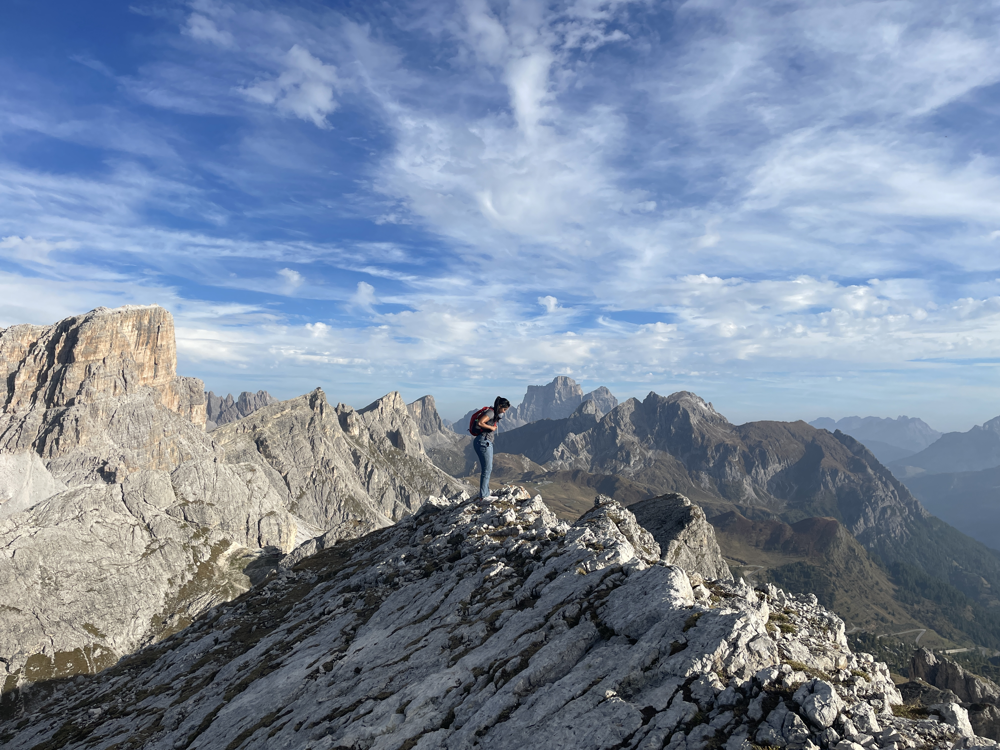
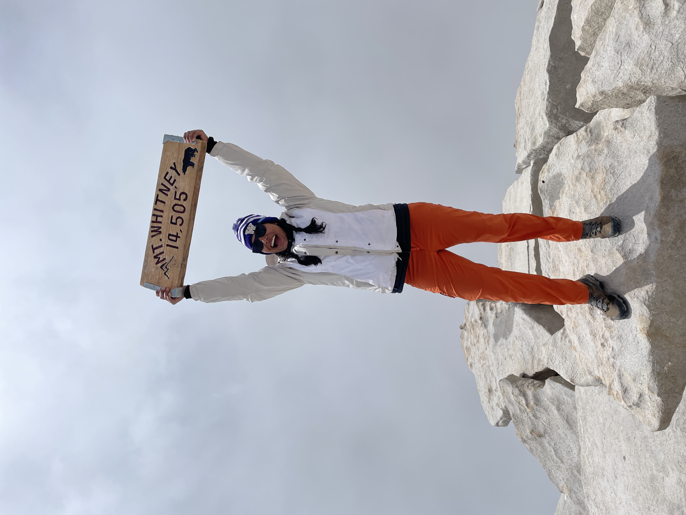

  

I'm Shivalika (shi-VAH-li-kah) Chavan (CHAH-vahn). I’m currently a Master’s student in Biostatistics at Columbia University in New York City. Looking ahead, I plan to focus my graduate work on leveraging data science for public health solutions—a passion I recently demonstrated as a Runner-Up at the [PRI Narrative 2 Numbers Hackathon](https://pandemicresponse.columbia.edu/pris-narrative-2-numbers-hackathon-turned-qualitative-insights-into-actionable-ideas/), where my team designed a community-driven outbreak detection system.

Originally a West Coast native, I graduated with my B.S. in Bioengineering (Data Science) with Honors and a Minor in Applied Mathematics from the University of Washington in Seattle. My career has been rooted in quantitative analysis, where I spent four years as a Senior Scientist in the Diagnostics Division at Roche working on the [Axelios SBX technology](https://sequencing.roche.com/global/en/article-listing/sequencing-platform-technologies.html). Previously I interned at Philips Emergency Care and Resuscitation contributing to post-market studies for medical devices (like AEDs) and worked as an undergraduate researcher in neural engineering and optogenetics at the [NERD Lab](https://sites.bioe.uw.edu/yazdan-azadeh/) under Dr. Azadeh Yazdan.

Download my resume [here](resume.html).

Outside of work, I’m an avid adventurer, spending my free time hiking, camping, rock climbing, solo traveling, and watercolor painting. I also love football (American football) and basketball. Go 49ers (and Dawgs!!) and Warriors! Check out some photos from my recent adventures:

  
  
  
  
  
  
  
  

